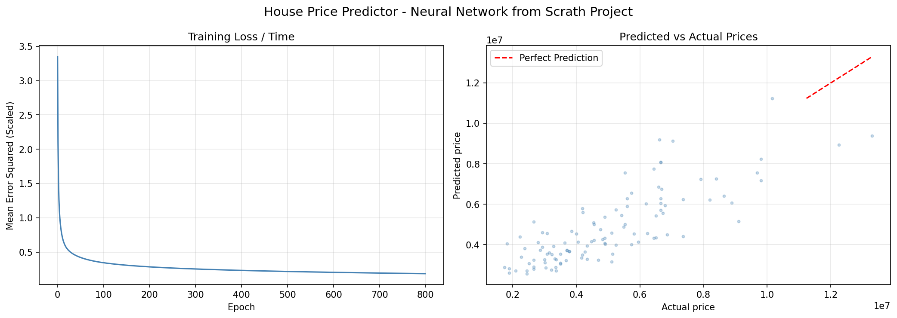

## Housing-Price-Predictor

A neural network built purely with NumPy that predicts house prices from a Kaggle Housing dataset.

## Results 

- R² Score : 0.6472
- Mean Absolute Error : ~ 1,021,225 rupees (~ £9,500)
- See results graph in repository (or at the bottom of this page)

## How to run

1. Install dependencies: <i> pip install numpy pandas matplotlib scikit-learn </i>
2. Place Housing.csv in the same folder as the script
3. Run: python "House Price Predictor.py"

## What this project demonstrates
Building a neural network from scratch without ML frameworks, demonstrating fundamentals such as forward propagation, backpropagation, and gradient descent manually using only NumPy.

## Used Libraries

- NumPy : implements the neural network itself
- pandas : loading and preparing CSV file data
- matplotlib : plotting the results graph
- scikit-learn : scaling and splitting data only

## Results graph

